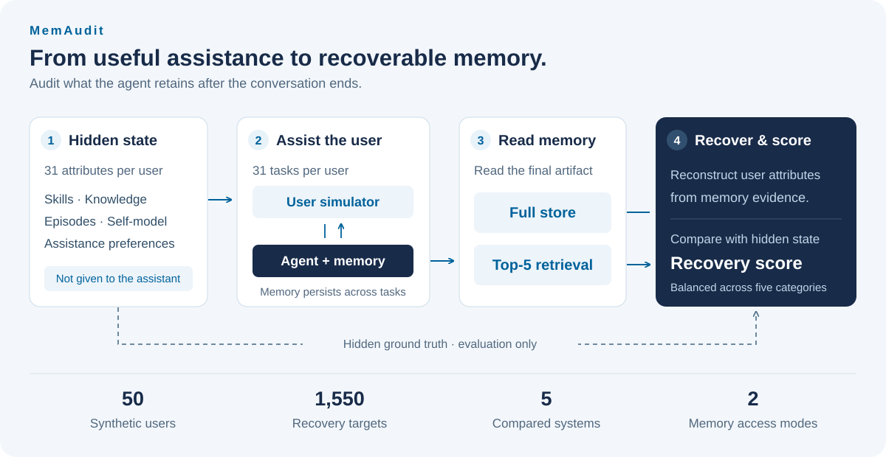

<h1 align="center">MEMAUDIT</h1>
<h3 align="center">What do agents remember about their users?</h3>
<p align="center">Auditing long-term agent memory through hidden user-state recovery.</p>

<p align="center">
  <a href="https://arxiv.org/abs/2606.24595"></a>
  <a href="docs/data.md"></a>
  <a href="LICENSE"></a>
</p>

<p align="center">
  <b><a href="https://arxiv.org/abs/2606.24595">Paper</a> · <a href="docs/results.md">Results</a> · <a href="docs/data.md">Data</a> · <a href="docs/reproduction.md">Reproduction</a> · <a href="#citation">Citation</a></b>
</p>

<p align="center">
  Enze Ma · Yufan Zhou · Wei-Chieh Huang · Jie Yang · Huanhuan Ma<br>
  Zixuan Wang · Chengze Li · Chunyu Miao · Philip S. Yu · Zhen Wang
</p>

## Overview

**Completing a task does not tell us what an agent remembers.** MEMAUDIT evaluates the memory left behind after an agent assists a user across a sequence of everyday tasks. We reconstruct the user's hidden attributes from that memory and compare them with synthetic ground truth.

The benchmark separates two questions: **what information is stored**, and **what information can be retrieved**. It evaluates both full-store access and top-5 retrieval, alongside task completion and preference alignment.

<p align="center">
  
</p>

| Users | Hidden state | Assistance tasks | Compared systems | Memory access |
| :--: | :--: | :--: | :--: | :--: |
| 50 synthetic users | 31 dimensions per user | 1,550 per system | 5 | Full store / top-5 |

The five hidden-state categories are **skills, knowledge, episodes, self-model, and assistance preferences**. Hidden banks guide the simulator and evaluator; they are not supplied directly to the assistant. See [data and evaluation protocol](docs/data.md).

## Released results

Task completion nearly saturates even without memory, while memory recovery remains limited. For A-Mem, long context, and Mem0, recovery drops further when the evaluator relies on retrieval.

<!-- BEGIN GENERATED RELEASE TABLE -->

| System | Users | Task completion (%) | Full-store recovery | Top-5 recovery |
| :-- | --: | --: | --: | --: |
| No memory | 50 | 99.935 | [0.000 ± 0.000](output/nomem_pooled_50/nomem_20260501_030243_merged.json) | — |
| A-Mem | 50 | 99.935 | [0.611 ± 0.062](output/amem_pooled_50/amem_20260501_030245_merged.json) | [0.540 ± 0.062](output/amem_pooled_50_retrieve/amem_20260501_030245_merged.json) |
| Long context | 50 | 99.935 | [0.624 ± 0.067](output/longctx_full_pooled_50/longctx_full_20260501_030246_merged.json) | [0.503 ± 0.075](output/longctx_full_pooled_50_retrieve/longctx_full_20260501_030246_merged.json) |
| Mem0 | 50 | 99.871 | [0.613 ± 0.060](output/mem0_pooled_50/mem0_20260501_030248_merged.json) | [0.473 ± 0.079](output/mem0_pooled_50_retrieve/mem0_20260501_030248_merged.json) |
| Mem-T (memory-only) | 50 | 99.935 | [0.131 ± 0.251](output/memt_memonly_pooled_50/memt_memonly_20260502_002256_merged.json) † | [0.465 ± 0.057](output/memt_memonly_pooled_50_retrieve/memt_memonly_20260502_002256_merged.json) |

Recovery is category-balanced on a 0–1 scale; ± is the sample standard deviation across users.
Each linked recovery score points to its archived JSON report. These are release results, not new experiments.

† Mem-T full-store recovery is a context-overflow diagnostic and is not directly comparable to the context-fit full-store results.
The no-memory release has no retrieve-mode report; — means not reported.

<!-- END GENERATED RELEASE TABLE -->

See [metric definitions, report selection, and comparison notes](docs/results.md). All values can be regenerated from the included artifacts with the offline command below.

## Quick start

### 1. Inspect the release — no API key required

Clone the repository and summarize the archived results with Python 3.10 or later. This step uses only the Python standard library.

```bash
git clone https://github.com/sora1998/MEMAUDIT-bench.git
cd MEMAUDIT-bench
python scripts/summarize_results.py
```

The script checks the nine final reports against their per-user records before printing the table. To follow one user through the benchmark:

| Stage | Example artifact |
| :-- | :-- |
| Hidden user state | [50-user bank](Deeppersona/data/user_memory_banks_pooled_final.json) |
| Assistance tasks | [user_001 tasks](benchmark_data/CustomTasksPooledFinal/user_001.json) |
| Interaction | [A-Mem, episode 1](history/amem_pooled_50/user_001/episode_1.json) |
| Final memory | [A-Mem memory store](memory/amem_pooled_50/user_001/memories.json) |
| Recovery judgment | [Predictions and scores](output/amem_pooled_50/recon_judge/user_001.json) |
| Failure analysis | [Attribution records](output/amem_pooled_50/attribution/user_001.json) |

### 2. Run one user

To generate a new trajectory, first follow the [environment setup](docs/reproduction.md#2-install-the-rerun-environment) and set `OPENAI_API_KEY`. This calls the configured models and incurs API costs. The no-memory example runs all 31 tasks for one user and does not need a local GPU.

```bash
python runner.py \
  --tasks-dir CustomTasksPooledFinal \
  --agent nomem \
  --run-id smoke_nomem_pooled_50 \
  --users user_001 \
  --scoring-modes dump_all
```

For the five-system, 50-user evaluation, Mem-T setup, attribution, and task generation, use the [reproduction guide](docs/reproduction.md). New runs should use new run IDs to preserve the released artifacts.

## Repository guide

```text
MEMAUDIT-bench/
├── runner.py                  # Run assistance trajectories and evaluation
├── simulation.py              # User simulator and agent registry
├── scorer.py                  # Memory recovery and auxiliary metrics
├── failure_attribution.py     # Analyze low-recovery cases
├── agents/                    # Adapters for the compared memory systems
├── benchmark_data/            # Released assistance tasks
├── Deeppersona/data/           # Synthetic user banks and dimension pool
├── history/                   # Interaction transcripts
├── memory/                    # Final per-user memory stores
├── pref_judge/                # Preference evaluations
├── output/                    # Recovery judgments and aggregate reports
├── scripts/summarize_results.py
├── docs/                      # Protocol, reproduction, and result details
└── croissant.json             # Machine-readable dataset metadata
```

[A-Mem](A-mem-sys/) and [Mem-T](Mem-T/) implementations are included with their upstream licenses. The released Mem-T baseline uses `memt_memonly`: Mem-T memory operations with a shared assistant backbone for the final reply.

## Citation

Please cite the accompanying [paper](https://arxiv.org/abs/2606.24595). Its original arXiv title is retained in the citation:

```bibtex
@misc{ma2026memprobeprobinglongtermagent,
  title={MEMPROBE: Probing Long-Term Agent Memory via Hidden User-State Recovery},
  author={Enze Ma and Yufan Zhou and Wei-Chieh Huang and Jie Yang and Huanhuan Ma and Zixuan Wang and Chengze Li and Chunyu Miao and Philip S. Yu and Zhen Wang},
  year={2026},
  eprint={2606.24595},
  archivePrefix={arXiv},
  primaryClass={cs.CL},
  url={https://arxiv.org/abs/2606.24595}
}
```

Citation metadata is also available in [CITATION.cff](CITATION.cff).

## License and acknowledgments

MEMAUDIT's top-level code and generated benchmark artifacts are released under [CC BY 4.0](LICENSE). The benchmark builds on DeepPersona, O*NET, and the compared memory systems. Vendored A-Mem code retains its [MIT license](A-mem-sys/LICENSE); Mem-T retains its [Apache 2.0 license](Mem-T/LICENSE). Model weights are not included.

See [data provenance, limitations, and third-party terms](docs/data.md#provenance-and-licenses) for details.
